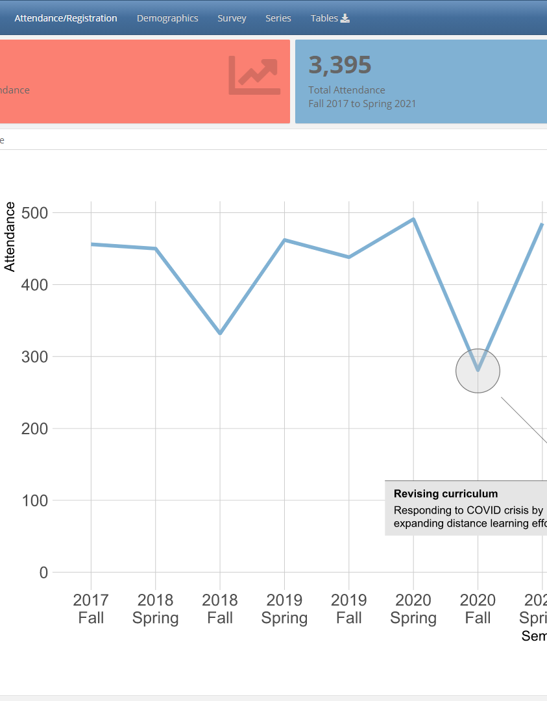

layout: true

```{r setup, include=FALSE}
options(htmltools.dir.version = FALSE)
library(tidyverse)
library(htmltools)
tagList(rmarkdown::html_dependency_font_awesome())
```

.footercc[
<i class="fab fa-creative-commons"></i>&nbsp; <i class="fab fa-creative-commons-by"></i><i class="fab fa-creative-commons-nc"></i>  <a href = "https://JohnLittle.info"><span class = "opacity30">https://</span>JohnLittle<span class = "opacity30">.info</span></a> 
<span class = "opacity30"> | <a href="https://github.com/libjohn/workshop_twitter_analysis">https://github.com/libjohn/workshop_twitter_analysis</a> | `r Sys.Date()` </span>
]

---
class: img-right-full



# Three tenets


- Just numbers
- Benefits of review
- Dashboard fatigue is a real thing 


???

- The implications of dashboard fatigue might be the most interesting thing to discuss in the QA

---
layout: false
class: img-left-full


## Drivers

- Goal: create a dashboard of workshop attendance 
- CDVS motivated by the possibility of exploring data 
- Dashboard can be the basis of another  workshop 

.footercc[
<i class="fab fa-creative-commons"></i>&nbsp; <i class="fab fa-creative-commons-by"></i><i class="fab fa-creative-commons-nc"></i>  <a href = "https://JohnLittle.info"><span class = "opacity30">https://</span>JohnLittle<span class = "opacity30">.info</span></a> 
<span class = "opacity30"> | <a href="https://github.com/libjohn/workshop_twitter_analysis">https://github.com/libjohn/workshop_twitter_analysis</a> | `r Sys.Date()` </span>
]

???

- These are not exactly the best drivers for creating a dashboard.  They’re not bad either.

---
layout: true

.footercc[
<i class="fab fa-creative-commons"></i>&nbsp; <i class="fab fa-creative-commons-by"></i><i class="fab fa-creative-commons-nc"></i>  <a href = "https://JohnLittle.info"><span class = "opacity30">https://</span>JohnLittle<span class = "opacity30">.info</span></a> 
<span class = "opacity30"> | <a href="https://github.com/libjohn/workshop_twitter_analysis">https://github.com/libjohn/workshop_twitter_analysis</a> | `r Sys.Date()` </span>
]

---


## Technology stack 


- R and the Tidyverse   
    - R is a data-first coding language   
    - R can be a universal interface for analysis and workflow   
- Tidyverse represents a very mature approach to workflow & the data life cycle  
- R has a bias towards enabling reproducibility   
    - scripting   
    - reporting   
    

  

  

  

    
???

- Reuse analysis code to produce reports, email alerts, interactive dashboards, etc.  

---

.bg-washed-blue.b--navy.ba.bw2.br3.shadow-5.ph4.mt5.center[

**Lesson**  
The last thing you should do is  
build the dashboard  
]

- Identify target audience and scope  
- Create summary reports   
- Build a static analysis   
- Generate push-reports based on dynamic thresholds  
- Advanced: Build a reporting application

???
Or, in this case, build a workshop attendance application

---
## Skipping those important questions 

- If developing the dashboard in R...  
    - Flexdashboard (dashboards)
    - Shiny (Web applications)

Not mutually exclusive but Flexdashboards has a significantly lower barrier to entry  

.center[] 

---
## Actual Goals  

- Host **cleaned and disaggregated data** 

- Provide a **summary of attendance** 


    
???

- Host **cleaned and disaggregated data** 
    - A data archive for clean data 
        - exported from the SpringShare registration system 
        - accounts for attendance
- Provide a **summary of attendance** so that staff can 
    - Assess their workshop’s impact over time (as measured by attendance and registration)
    - See current semester attendance totals within the context of multi-year totals


---
layout: false
class:  middle, center

<br>

.bg-washed-blue.b--navy.ba.bw2.br3.shadow-5.ph4.mt5[


## John R Little

.f5.blue[Data Science Librarian  
Center for Data & Visualization Sciences  
Duke University Libraries  
]

.f7[https://johnlittle.info  
https://Rfun.library.duke.edu  
https://library.duke.edu/data  
]
]


<i class="fab fa-creative-commons fa-2x"></i> &nbsp; <i class="fab fa-creative-commons-by fa-2x"></i><i class="fab fa-creative-commons-nc fa-2x"></i>  
.f6.moon-gray[Creative Commons:  Attribution-NonCommercial 4.0]  
.f7.moon-gray[https://creativecommons.org/licenses/by-nc/4.0]